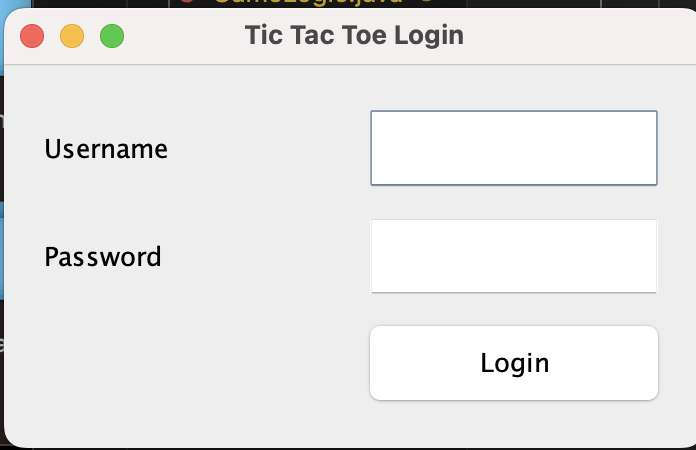
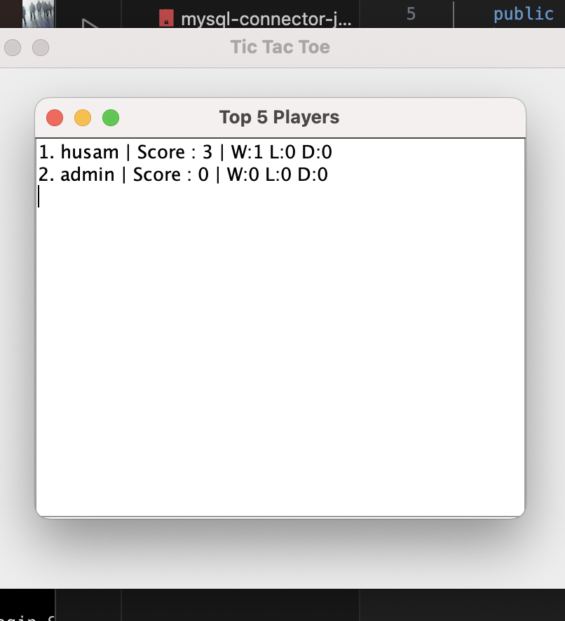

# Simple Tic-Tac-Toe Game with Java Swing, Login, and Statistics
## Student Information
- Name: Husam Al Ghazali Putra Slamwa
- Student ID: 5026251121
- Class: Programming Fundamental (E)

## Description
This project is a simple Tic-Tac-Toe game built using Java Swing. The application includes login, game statistics, and Top 5 scorer features.

## Features
- Login using database
- Play Tic tac toe
- Records Wins, Losses, and draws history
- Personal stat

## Database
Database Used: MySQL (XAMPP)

## Class Explanation
- Main: Starts the program and opens the Login Window.
- DatabaseManager: Handles JDBC database connection.
- Player: Stores player data such as id, username, wins, losses, draws, and score.
- PlayerService: Handles login, updating statistics, and retrieving Top 5 scorers from the database.
- GameLogic: Handles move validation, winner checking, draw checking, and computer moves.
- LoginFrame: Swing window for username and password input.
- MainMenuFrame: Swing window for the main menu navigation.
- GameFrame: Swing window for playing the game.
- StatisticsFrame: Swing window for showing personal statistics.
- TopScorersFrame: Swing window for showing Top 5 scorers using a table.

## Screenshot
### Login Screen

### Game Screen

### Leaderboard

## Demonstration Video
Link YouTube: https://youtu.be/9TDVL1JQCdI
